# Lab 3 — Distributed Database Deployment with CockroachDB on Kubernetes

## Overview

This lab demonstrates the deployment and operation of a distributed SQL database using CockroachDB on Kubernetes. The system was deployed using a StatefulSet with persistent storage and scaled dynamically across multiple Kubernetes nodes.

The lab focuses on:

* Distributed database deployment
* Stateful workloads in Kubernetes
* Persistent distributed storage
* Horizontal scaling
* Automatic sharding and replication
* Fault tolerance
* Distributed SQL analytics
* Semi-structured JSON querying

---

# Technologies Used

| Component               | Technology              |
| ----------------------- | ----------------------- |
| Container Orchestration | Kubernetes              |
| Distributed Database    | CockroachDB v25.1.0     |
| Storage                 | Ceph Persistent Volumes |
| Cluster Management      | kubectl                 |
| Dataset                 | Fashion Shop Dataset    |
| Data Types              | Relational + JSONB      |

---

# Cluster Information

## Kubernetes Nodes

The CockroachDB cluster was deployed across multiple Kubernetes worker nodes.

Example nodes:

* k1
* k2
* k3
* k4
* k5
* k6

---

# Storage Classes

The Kubernetes cluster provided multiple storage classes.

```bash
kubectl get storageclass
```

Example output:

```text
NAME        PROVISIONER                     RECLAIMPOLICY   VOLUMEBINDINGMODE
ceph-hdd    rook-ceph.rbd.csi.ceph.com     Delete          Immediate
ceph-nvme   rook-ceph.rbd.csi.ceph.com     Delete          Immediate
ceph-ssd    rook-ceph.rbd.csi.ceph.com     Delete          Immediate
cephfs      rook-ceph.cephfs.csi.ceph.com  Delete          Immediate
```

The `ceph-hdd` storage class was used for persistent distributed storage.

---

# CockroachDB Deployment

## CockroachDB StatefulSet Configuration

File: `cockroachdb.yaml`

```yaml
apiVersion: v1
kind: Service
metadata:
  name: cockroachdb
spec:
  clusterIP: None
  selector:
    app: cockroachdb
  ports:
    - name: grpc
      port: 26257
      targetPort: 26257
    - name: http
      port: 8080
      targetPort: 8080
---
apiVersion: apps/v1
kind: StatefulSet
metadata:
  name: cockroachdb
spec:
  serviceName: cockroachdb
  replicas: 3
  selector:
    matchLabels:
      app: cockroachdb
  template:
    metadata:
      labels:
        app: cockroachdb
    spec:
      containers:
      - name: cockroachdb
        image: cockroachdb/cockroach:v25.1.0
        ports:
        - containerPort: 26257
          name: grpc
        - containerPort: 8080
          name: http
        command:
          - /bin/bash
          - -ecx
          - |
            exec cockroach start \
              --insecure \
              --join=cockroachdb-0.cockroachdb,cockroachdb-1.cockroachdb,cockroachdb-2.cockroachdb \
              --advertise-addr=$(hostname -f) \
              --http-addr=0.0.0.0:8080 \
              --cache=.25 \
              --max-sql-memory=.25
        volumeMounts:
        - name: datadir
          mountPath: /cockroach/cockroach-data
        resources:
          requests:
            cpu: "2"
            memory: 6Gi
          limits:
            cpu: "2"
            memory: 6Gi
  volumeClaimTemplates:
  - metadata:
      name: datadir
    spec:
      accessModes:
        - ReadWriteOnce
      storageClassName: ceph-hdd
      resources:
        requests:
          storage: 10Gi
```

---

# Deployment Steps

## 1. Apply StatefulSet

```bash
kubectl apply -f cockroachdb.yaml
```

---

## 2. Verify Pods

```bash
kubectl get pods -o wide
```

Example:

```text
cockroachdb-0   Running
cockroachdb-1   Running
cockroachdb-2   Running
```

---

## 3. Initialize Cluster

```bash
kubectl exec -it cockroachdb-0 -- \
cockroach init --insecure
```

---

## 4. Check Node Status

```bash
kubectl exec -it cockroachdb-0 -- \
cockroach node status --insecure
```

Example:

```text
id | address | is_live
1  | cockroachdb-0 | true
2  | cockroachdb-1 | true
3  | cockroachdb-2 | true
```

---

# Database Creation

## Open SQL Shell

```bash
kubectl exec -it cockroachdb-0 -- \
cockroach sql --insecure --database=fashion_shop
```

---

## Create Database

```sql
CREATE DATABASE fashion_shop;
USE fashion_shop;
```

---

# Table Schemas

## Users Table

```sql
CREATE TABLE users (
    uid STRING PRIMARY KEY,
    first_name STRING,
    last_name STRING,
    email STRING,
    password STRING,
    city STRING,
    country STRING
);
```

---

## Items Table

```sql
CREATE TABLE items (
    id INT PRIMARY KEY,
    data JSONB,
    price DECIMAL,
    discounted_price DECIMAL,
    in_stock INT
);
```

---

## Sales Table

```sql
CREATE TABLE sales (
    id INT PRIMARY KEY,
    item_id INT,
    uid STRING,
    sale_date STRING,
    sale_price STRING,
    discount STRING,
    quantity INT,
    review_date STRING,
    review_text STRING,
    review_text_lang STRING,
    rating STRING,
    return_date STRING,
    return_reason STRING
);
```

---

# Dataset Download

## Download Datasets

On macOS:

```bash
curl -O https://db.iue.haw-kiel.de/ddis/fashion-shop/users.csv
curl -O https://db.iue.haw-kiel.de/ddis/fashion-shop/sales.csv
curl -O https://db.iue.haw-kiel.de/ddis/fashion-shop/items.zip
```

---

## Extract JSON Dataset

```bash
unzip items.zip
```

---

# Copy Datasets into CockroachDB Pod

## Create External Directory

```bash
kubectl exec -it cockroachdb-0 -- mkdir -p /cockroach/cockroach-data/extern
```

---

## Copy CSV Files

```bash
kubectl cp users.csv \
cockroachdb-0:/cockroach/cockroach-data/extern/users.csv

kubectl cp sales.csv \
cockroachdb-0:/cockroach/cockroach-data/extern/sales.csv
```

---

# Import Data

## Import Users Dataset

```sql
IMPORT INTO users
CSV DATA ('nodelocal://1/users.csv')
WITH skip = '1';
```

Result:

```text
540357 rows imported
```

---

## Import Sales Dataset

```sql
IMPORT INTO sales
DELIMITED DATA ('nodelocal://1/sales.csv')
WITH
    skip = '1',
    fields_terminated_by = ',',
    fields_enclosed_by = '"',
    fields_escaped_by = E'\\';
```

Result:

```text
10343240 rows imported
```

---

# Verify Data

## Users Count

```sql
SELECT count(*) FROM users;
```

Output:

```text
540357
```

---

## Sales Count

```sql
SELECT count(*) FROM sales;
```

Output:

```text
10343240
```

---

# Scaling the Cluster

## Scale Down

```bash
kubectl scale statefulset cockroachdb --replicas=2
```

---

## Scale Up

```bash
kubectl scale statefulset cockroachdb --replicas=6
```

---

## Verify Scaling

```bash
kubectl get pods -o wide
```

Result:

```text
cockroachdb-0 Running
cockroachdb-1 Running
cockroachdb-2 Running
cockroachdb-3 Running
cockroachdb-4 Running
cockroachdb-5 Running
```

---

# Distributed Storage and Sharding

## View Table Ranges

```sql
SHOW RANGES FROM TABLE sales;
```

This demonstrated:

* automatic range splitting
* distributed partitioning
* shard creation

---

## Detailed Range Information

```sql
SHOW RANGES FROM TABLE sales WITH DETAILS;
```

Example observations:

```text
replicas {1,5,6}
lease_holder = 6
```

This demonstrated:

* replica redistribution
* Raft consensus leadership
* dynamic balancing
* elastic distributed storage

---

# Indexing

## Create Indexes

```sql
CREATE INDEX idx_users_email
ON users(email);

CREATE INDEX idx_sales_uid
ON sales(uid);

CREATE INDEX idx_sales_item
ON sales(item_id);
```

---

## Verify Indexes

```sql
SHOW INDEXES FROM sales;
```

---

# Distributed Analytical Queries

## Top Countries

```sql
SELECT country, count(*)
FROM users
GROUP BY country
ORDER BY count(*) DESC
LIMIT 10;
```

Example output:

```text
United States  197603
Germany         62205
India           48109
```

---

## Top Selling Products

```sql
SELECT item_id, sum(quantity) AS total_sales
FROM sales
GROUP BY item_id
ORDER BY total_sales DESC
LIMIT 10;
```

---

## Average Rating

```sql
SELECT avg(CAST(rating AS INT))
FROM sales
WHERE rating IS NOT NULL
  AND rating != '';
```

Output:

```text
3.21
```

---

## Rating Distribution

```sql
SELECT rating, count(*)
FROM sales
WHERE rating != ''
GROUP BY rating
ORDER BY rating;
```

---

# JSON Queries

CockroachDB supports PostgreSQL-compatible JSON operators.

## Query JSON Data

```sql
SELECT
  id,
  data->>'usage' AS usage
FROM items
LIMIT 10;
```

Example output:

```text
2130 | Casual
3371 | Sports
```

This demonstrated:

* semi-structured storage
* JSON querying
* hybrid relational + JSON model

---

# Fault Tolerance

The cluster demonstrated fault tolerance using Raft replication.

Observations:

* cluster continued functioning after scale-down
* replicas redistributed automatically
* quorum maintained
* lease holders migrated dynamically

---

# Key Results

| Feature             | Result                     |
| ------------------- | -------------------------- |
| Nodes               | 6-node CockroachDB cluster |
| Users Dataset       | 540,357 rows               |
| Sales Dataset       | 10,343,240 rows            |
| Storage             | Persistent Ceph volumes    |
| Replication         | RF=3                       |
| Sharding            | Automatic range splitting  |
| Scaling             | 3 → 6 nodes                |
| JSON Support        | Working                    |
| Distributed Queries | Successful                 |

---

# Important Observations

## 1. Automatic Sharding

CockroachDB automatically split large tables into multiple ranges as data volume increased.

---

## 2. Replica Redistribution

After scaling the cluster to 6 nodes, replicas were automatically redistributed across new nodes.

Example:

```text
replicas {4,5,6}
lease_holder = 6
```

This proves elastic distributed balancing.

---

## 3. Distributed SQL

Analytical queries executed successfully across more than 10 million rows.

---

## 4. JSON Support

CockroachDB supported querying nested JSON fields using PostgreSQL JSON operators.

---

# Challenges Encountered

## Persistent Volume Claim Errors

Initial StatefulSet deployment failed because PVC configuration was placed incorrectly.

Solution:

* moved storage configuration into `volumeClaimTemplates`

---

## Cluster Join Command Error

Initial cluster startup failed due to incorrect spacing in:

```text
--join=
```

Solution:

* removed spaces between node addresses

Correct format:

```text
--join=cockroachdb-0.cockroachdb,cockroachdb-1.cockroachdb,cockroachdb-2.cockroachdb
```

---

## CSV Import Errors

The sales dataset contained:

* commas inside quoted text
* escaped quotes
* empty numeric fields

Solution:

```sql
fields_enclosed_by = '"'
fields_escaped_by = E'\\'
```

---

# Conclusion

This lab successfully demonstrated deployment and operation of a distributed SQL database system using CockroachDB on Kubernetes.

The system demonstrated:

* distributed deployment
* automatic sharding
* replication
* horizontal scaling
* fault tolerance
* distributed SQL analytics
* semi-structured JSON support

CockroachDB automatically redistributed replicas and balanced workloads after cluster scaling, proving elastic distributed database behavior.

The lab successfully handled over 10 million rows of distributed data while supporting analytical and JSON queries.

---

# Screenshots Documentation

The repository contains organized screenshots demonstrating every major stage of the distributed database deployment and evaluation.

# Kubernetes Deployment

## Kubernetes Pods

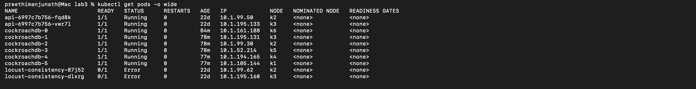

Shows CockroachDB StatefulSet pods distributed across Kubernetes worker nodes.

Demonstrates:

* Kubernetes orchestration
* distributed deployment
* multi-node scheduling
* horizontal scaling

---

## Cluster Node Status

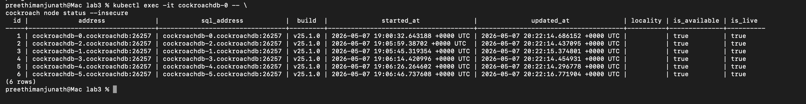

Shows all CockroachDB nodes live and operational.

Demonstrates:

* healthy distributed cluster
* active nodes
* cluster membership
* node availability

---

# Scaling Demonstration

## Scale Down to 2 Nodes

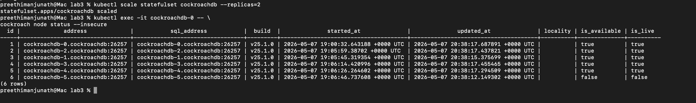

Shows the cluster after scaling down to 2 nodes.

Demonstrates:

* fault tolerance
* quorum behavior
* cluster survivability

---

## Scale Up to 6 Nodes

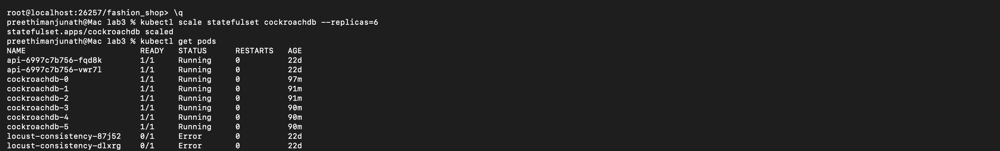

Shows successful horizontal scaling to 6 nodes.

Demonstrates:

* elastic scaling
* automatic pod provisioning
* distributed expansion

---

# Database Structure

## Database Tables

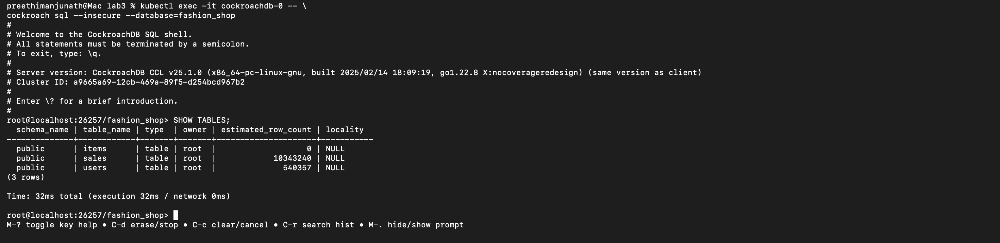

Shows all tables inside the `fashion_shop` database.

Tables:

* users
* sales
* items

---

## Users Dataset Import

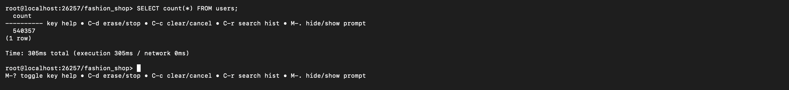

Shows successful import of the users dataset.

Dataset size:

* 540,357 rows

---

## Sales Dataset Import

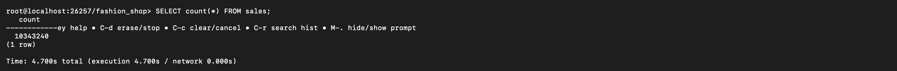

Shows successful import of the sales dataset.

Dataset size:

* 10,343,240 rows
* approximately 1.4 GB imported

---

# Distributed Storage and Sharding

## Automatic Range Splitting

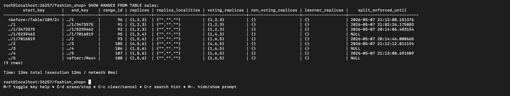

Shows automatic range splitting for the sales table.

Demonstrates:

* automatic sharding
* distributed partitioning
* CockroachDB range management

---

## Detailed Replica Distribution

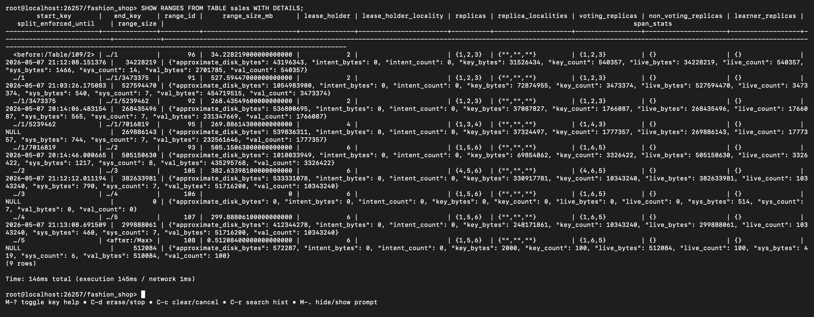

Shows detailed replica placement and lease-holder distribution.

Important observations:

```text
replicas {1,5,6}
lease_holder = 6
```

This demonstrates:

* replica redistribution
* Raft consensus leadership
* automatic balancing
* workload migration after scaling

---

# Indexing

## Sales Indexes

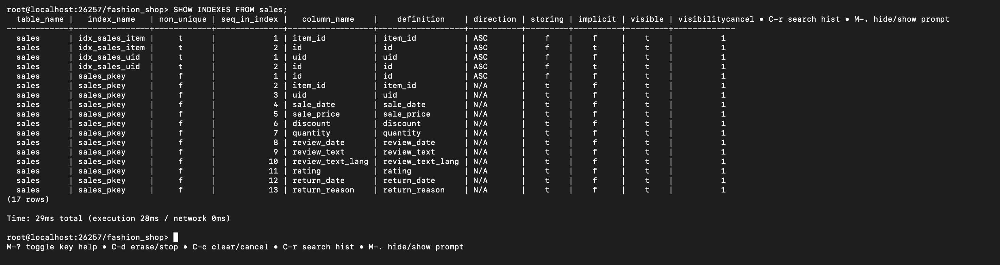

Shows indexes created for query optimization.

Indexes:

* idx_users_email
* idx_sales_uid
* idx_sales_item

---

# Distributed Analytical Queries

## Top Countries Query

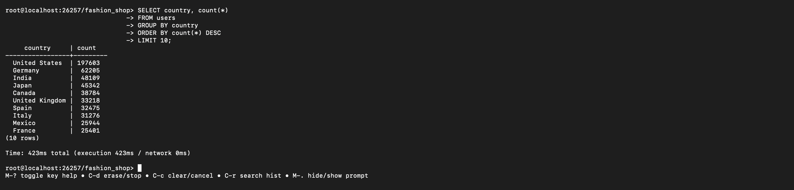

Shows distributed aggregation query over the users dataset.

Demonstrates:

* GROUP BY execution
* distributed aggregation
* analytical processing

---

## Top Selling Items

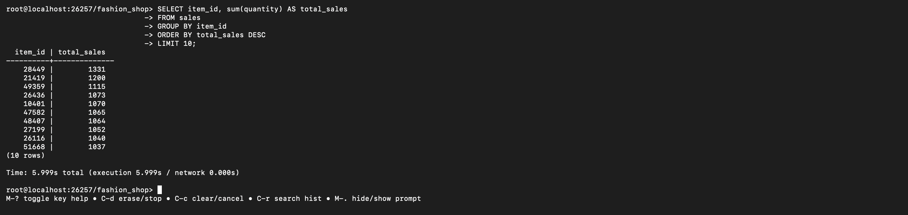

Shows analytical processing over more than 10 million sales rows.

Demonstrates:

* distributed SQL execution
* aggregation over large datasets
* query scalability

---

## Average Rating Query

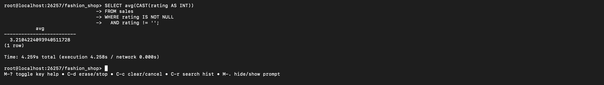

Shows numerical aggregation across the distributed sales dataset.

Demonstrates:

* distributed computation
* aggregation functions
* large-scale analytics

---

## Rating Distribution

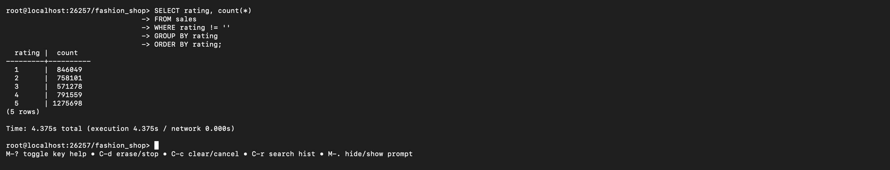

Shows grouped analytical queries on ratings data.

Demonstrates:

* GROUP BY processing
* distributed analytics
* aggregation performance

---

# JSON and Semi-Structured Queries

## JSON Query on Items

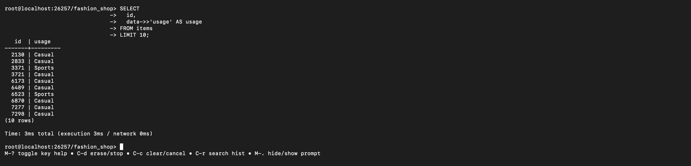

Shows PostgreSQL-compatible JSON querying in CockroachDB.

Example:

```sql
SELECT
  id,
  data->>'usage' AS usage
FROM items
LIMIT 10;
```

Demonstrates:

* JSONB support
* semi-structured querying
* hybrid relational + JSON model

---

# Repository Structure

```text
lab3/
├── README.md
├── cockroachdb.yaml
├── screenshots/
│   ├── 01_kubernetes_pods.png
│   ├── 02_cluster_node_status.png
│   ├── 03_scale_down_2_nodes.png
│   ├── 04_scale_up_6_nodes.png
│   ├── 05_database_tables.png
│   ├── 06_users_row_count.png
│   ├── 07_sales_row_count.png
│   ├── 08_sales_ranges.png
│   ├── 09_sales_ranges_detailed.png
│   ├── 10_sales_indexes.png
│   ├── 11_top_countries_query.png
│   ├── 12_top_selling_items.png
│   ├── 13_average_rating_query.png
│   ├── 14_rating_distribution.png
│   └── 15_json_query_items.png
├── .gitignore
└── cockroachdb.yaml
```

Datasets were downloaded from the course source and imported locally.

Large datasets such as:

* users.csv
* sales.csv
* items.zip
* extracted item_data/

were excluded from Git using `.gitignore` to keep the repository lightweight and manageable.

---

# Git Ignore Configuration

File: `.gitignore`

```gitignore
*.csv
*.zip
item_data/
__MACOSX/
.DS_Store
```

---

# Useful Commands Summary

```text
lab3/
├── cockroachdb.yaml
├── README.md
├── screenshots/
├── users.csv
├── sales.csv
├── items.zip
└── item_data/
```

---

# Useful Commands Summary

## Open SQL Shell

```bash
kubectl exec -it cockroachdb-0 -- \
cockroach sql --insecure --database=fashion_shop
```

---

## Check Pods

```bash
kubectl get pods -o wide
```

---

## Check Cluster Nodes

```bash
kubectl exec -it cockroachdb-0 -- \
cockroach node status --insecure
```

---

## Show Ranges

```sql
SHOW RANGES FROM TABLE sales;
```

---

## Show Detailed Distribution

```sql
SHOW RANGES FROM TABLE sales WITH DETAILS;
```

---

## Exit SQL Shell

```sql
\q
```
